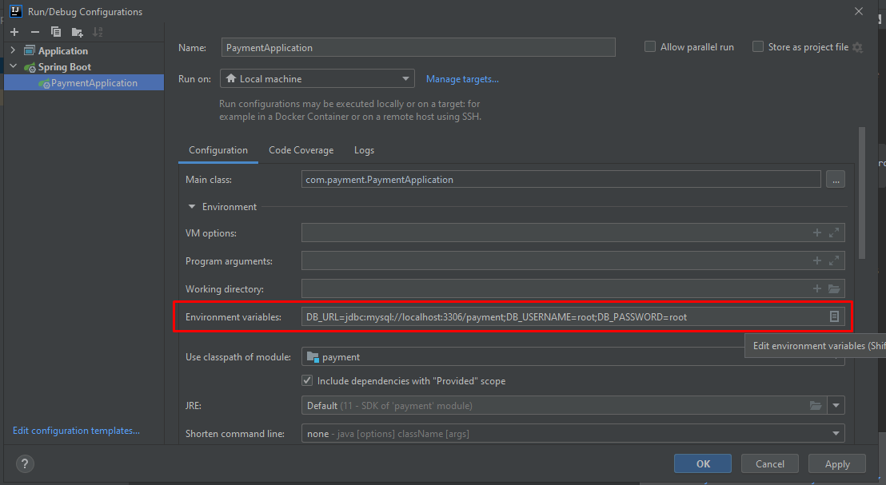

### Como instalar e rodar

*Antes de tudo você precisa ter o Java (se possível JDK11) e o Maven instalados*

**1. Clone o repositório**
   ```
   git clone https://github.com/ghisiluizgustavo/desafio-dev-api-rest.git
   ```
**2. Abra o projeto no IntelliJ e vá em *Edit Configurations***



**3. Em *Edit Configurations* adicione os seguintes valores para as seguintes
variáveis de ambiente:**


**DB_URL**=*jdbc:mysql://localhost:3306/payment;*

**DB_USERNAME**=*seu usuário do mysql*

**DB_PASSWORD**=*sua senha do mysql*

**4. Agora é so rodar (Shift + F10 ou usando o botão de _Play_)**